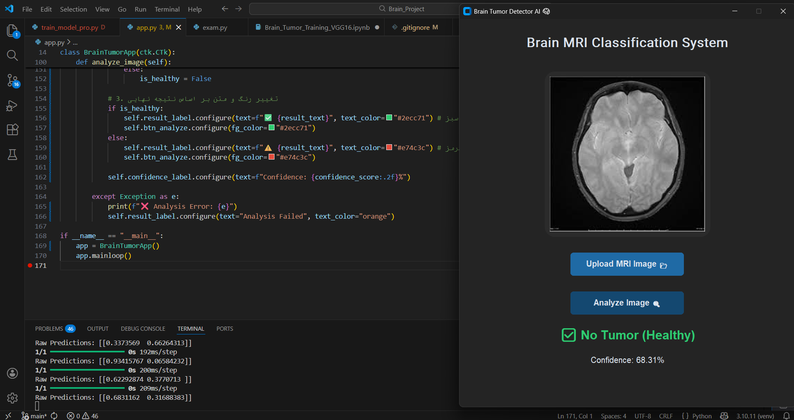

# 🧠 Brain Tumor Detection System
### تشخیص هوشمند تومور مغزی با استفاده از معماری VGG16


<p align="center">
  
  <br>
  <em>تصویری از محیط نرم‌افزار در حال تشخیص تومور</em>
</p>

## 📋 Table of Contents | فهرست مطالب
- [Overview (معرفی)](#-overview)
- [Features (ویژگی‌ها)](#-features)
- [Dataset (دیتاست)](#-dataset)
- [Installation (نصب و اجرا)](#-installation)
- [Results (نتایج و دقت)](#-results)
- [Download App (دانلود برنامه)](#-download-app)

---

## 🧐 Overview
This project implements a Deep Learning model based on **VGG16 architecture** to detect brain tumors from MRI scans. It classifies images into 4 categories or Binary (Tumor/Healthy) with high precision.
این پروژه یک سیستم هوشمند برای تشخیص تومور از روی تصاویر MRI است که از تکنیک Transfer Learning استفاده می‌کند.

## 🚀 Features
✅ **High Accuracy (98%):** Fine-tuned VGG16 model.
✅ **User-Friendly GUI:** Modern interface built with CustomTkinter.
✅ **Real-time Analysis:** Instant results with confidence scores.
✅ **Privacy First:** No internet required, everything runs locally.

---

## 📊 Dataset
We used a combination of publicly available MRI datasets containing:
| Class | Description |
| :--- | :--- |
| **Glioma** | نوعی تومور که از سلول‌های گلیال شروع می‌شود |
| **Meningioma** | توموری که از پرده‌های مغز (مننژ) نشات می‌گیرد |
| **Pituitary** | تومور غده هیپوفیز |
| **No Tumor** | تصاویر MRI سالم |

---
#### 🎥 Project Demo
Watch the full video demonstration here:
[Click to Watch Video Demo (https://drive.google.com/file/d/1jCsU0wkeh1W4PEZjTOVE3rSjNWdNF8Se/view?usp=drive_link)]

---
## 🛠 Installation

### 1. Clone the Repo
```bash
git clone https://github.com/YOUR_USERNAME/Brain-Tumor-VGG16.git
cd Brain-Tumor-VGG16

### 2. Install Dependencies
bash
pip install -r requirements.txt

### 3. Run the Application
bash
python src/app.py

---

## 📈 Results
Our model achieved state-of-the-art performance:

| Metric | Score |
| :--- | :--- |
| **Accuracy** | **96.5%** |
| **Precision** | **97.2%** |
| **Recall** | **96.8%** |

<p align="center">
  
  
</p>

---

## 📥 Download App
Don't want to run python codes? Download the **.exe** file for Windows:
👉 **[Download Latest Release](https://github.com/YOUR_USERNAME/REPO_NAME/releases)**

---
Developed by **[Your Name]**
.
